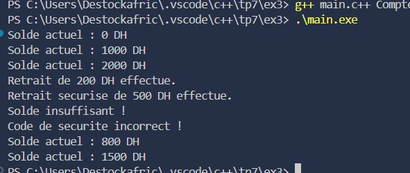
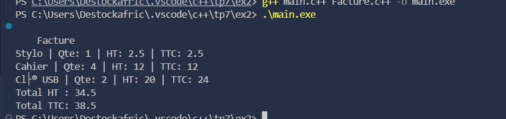

# TP C++ – Surcharge de Constructeurs et Méthodes

##  Description
Ce projet regroupe trois exercices démontrant la **surcharge de constructeurs et de méthodes** en C++.  
Chaque exercice illustre comment adapter le comportement d'une classe selon les paramètres fournis, dans des contextes variés (contacts, facturation, banque).

---

###  Exercice 1 : Gestion d’un carnet d’adresses

#### Objectif
Comprendre la **surcharge de constructeurs** pour permettre la création d’objets avec différentes quantités d’informations.

#### Énoncé
Créer une classe `Contact` représentant un contact avec :
- Un nom
- Un numéro de téléphone (optionnel)
- Une adresse email (optionnelle)

Trois constructeurs doivent permettre :
1. Créer un contact avec un nom uniquement  
2. Créer un contact avec un nom et un numéro  
3. Créer un contact avec un nom, un numéro et un email  

Une méthode `afficher()` affiche les informations du contact.

#### Fonctionnalités
- Plusieurs constructeurs pour une flexibilité d’utilisation  
- Affichage clair et complet des informations du contact  
- Encapsulation des données  

####  Résultat
Création et affichage de plusieurs contacts avec différents niveaux d’information.  

---

###  Exercice 2 : Système de facturation – Surcharge de méthodes

#### Objectif
Apprendre à **surcharger des méthodes** pour offrir plusieurs manières d’ajouter un article à une facture.

#### Énoncé
Créer une classe `Facture` avec la méthode `ajouterArticle()` :
1. `ajouterArticle(nom, prix)`  
2. `ajouterArticle(nom, prix, quantité)`  
3. `ajouterArticle(nom, prix, quantité, tauxTVA)`  

Les articles sont stockés dans un tableau dynamique (`std::vector`).  
Une méthode `afficherTotal()` calcule et affiche le montant total.

#### Fonctionnalités
- Gestion d’une facture avec plusieurs versions d’ajout d’article  
- Calcul automatique du total avec TVA  
- Utilisation de `std::vector` pour un stockage dynamique  

####  Résultat
Affichage du total de la facture après l’ajout de plusieurs articles avec ou sans TVA.  

---

###  Exercice 3 : Banque – Constructeurs surchargés et logique métier

#### Objectif
Utiliser la **surcharge de constructeurs et de méthodes** pour adapter le comportement d’un compte bancaire selon les données et la sécurité.

#### Énoncé
Créer une classe `CompteBancaire` :
- Trois constructeurs :
  1. Sans paramètres (solde = 0)  
  2. Avec un solde initial  
  3. Avec un solde initial et un code de sécurité  
- Méthodes :
  - `afficherSolde()` : affiche le solde actuel  
  - `retrait(montant)` : retire de l’argent si possible  
  - `retrait(montant, code)` : retire avec vérification du code de sécurité  

#### Fonctionnalités
- Sécurité renforcée avec code optionnel  
- Vérification du solde avant retrait  
- Plusieurs façons d’ouvrir un compte  
- Exemple d’utilisation dans `main()`

####  Résultat
Affichage des soldes avant et après retrait, avec gestion des erreurs (solde insuffisant, code erroné, etc.).  

---

##  Concepts abordés
- Surcharge de constructeurs (`overloaded constructors`)
- Surcharge de méthodes (`method overloading`)
- Encapsulation des données
- Logique métier simple orientée objet
- Utilisation de `std::vector` et gestion dynamique

---

##  Technologies utilisées
- **Langage :** C++  
- **IDE recommandé :** VS Code  
- **Compilateur :** g++  

